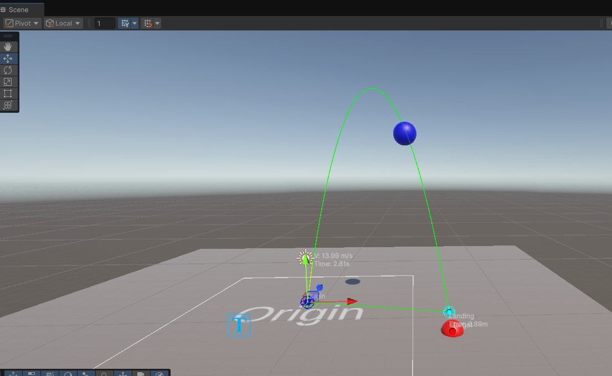
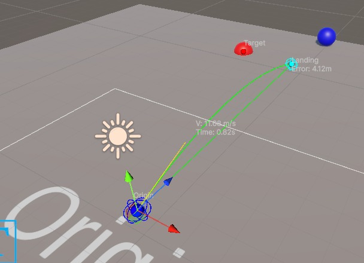
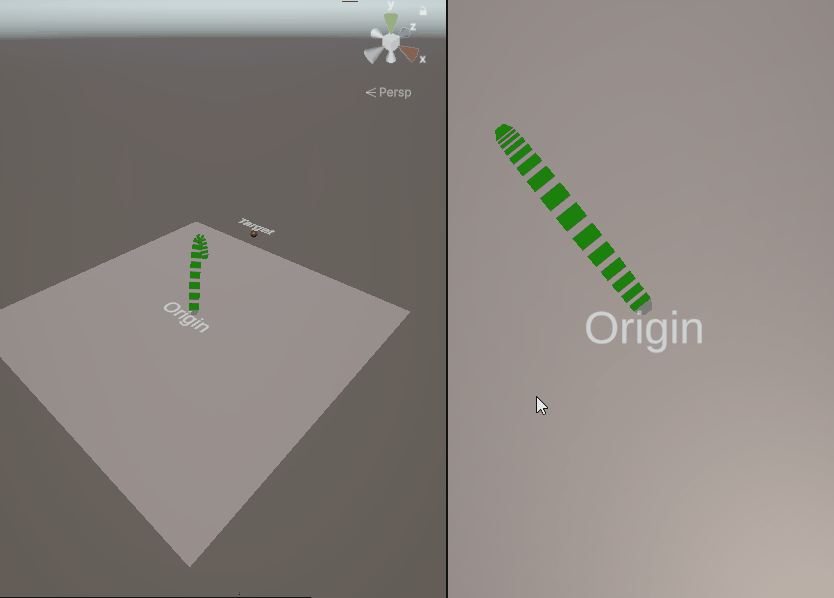

# Perfect Aim

The perfect aim project aims (Pun not intended) to create a system for accuractely calculating arcs, speeds and more for targetting and firing solutions in Unity.

## Basic Calculation

## Basic Wind

## Velocity Support

